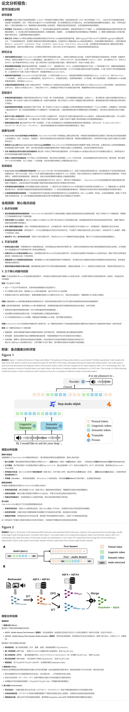

# 论文阅读agent
tips: 建议放在pdf文件夹下的pdf文件名称自己手动改的简单点，比如example.pdf，这样不容易出错。

# 使用方式
## 1. pdf预处理
感谢 mineru 提供的 pdf 预处理工具，请参考 [mineru](https://github.com/opendatalab/MinerU) 获得更详细信息。
这里安装方式如下：
```bash
conda create -n mineru 'python=3.12' -y
conda activate mineru
pip install -U "magic-pdf[full]"
```
这样安装好环境后还需要下载模型权重与指定权重索引。

- 下载模型权重：
```bash
cd pdf_preprocess
python download_models.py
```
这会自动在pdf_preprocess/models下载权重，并在pdf_preprocess/magic-pdf.json中指定权重索引。

- 指定权重索引：
- Windows (PowerShell):
```bash
# 设置环境变量
$env:MINERU_TOOLS_CONFIG_JSON = "PATH_TO_paperagent/pdf_preprocess/magic-pdf.json"
# 运行命令
magic-pdf -p example.pdf -o ./output -m auto
```

- Linux/macOS:
```bash
# 设置环境变量
export MINERU_TOOLS_CONFIG_JSON=PATH_TO_paperagent/pdf_preprocess/magic-pdf.json
# 运行命令
magic-pdf -p example.pdf -o ./output -m auto
```

配置好后可以将pdf文件放在paperagent/pdf_preprocess/pdf/下，比如paperagent/pdf_preprocess/pdf/example.pdf，然后运行：
```bash
cd paperagent/pdf_preprocess
magic-pdf -p pdf\example.pdf -o .\output\ -m auto
```
这会在output/example/auto/example.md中生成论文对应的markdown文件，并生成images文件夹用于存放图片。

至此，pdf预处理完成。

## 1.5 论文阅读环境配置
1. pip install -r requirements.txt。
2. .env.example中配置大模型apilkey等信息（这里都用的Qwen）。
3. 运行test_api.py检测环境配置与apikey设置是否有误。

## 2. 论文阅读
根据你pdf处理后保存的名称，比如example.pdf
修改main.py里的PAPER_NAME = "example"

然后运行：
```bash
python main.py
```
即可在paperagent/output/example/Final_Report.md中生成论文阅读报告。

## 报告样例



- pdf_preprocess\pdf\1.pdf 生成的报告如下：
- 最终报告文件：[assets\Final_Report.md](assets\Final_Report.md)


## TODO
- [ ] 一键生成报告而非自己多步操作
- [ ] 复杂pdf名称提取与论文名称自动提取
- [ ] 多pdf自动处理